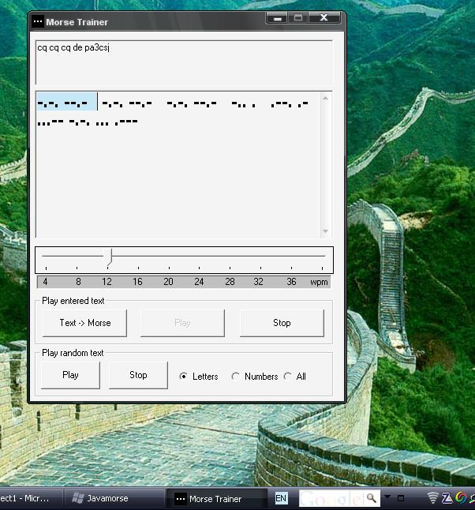



## Javamorse Morsetrainer

### Description

This is a morse trainer application. Converts text into morse strings which can be played using direct sound. The trainer can also generate random text continuously and play this.
 
### More Info
 
Only tested on winxp, requires DX7

             |
---                |---
**Submitted On**   |2009-09-03 04:10:02
**By**             |[ronpinoy](https://github.com/Planet-Source-Code/PSCIndex/blob/master/ByAuthor/ronpinoy.md)
**Level**          |Beginner
**User Rating**    |5.0 (10 globes from 2 users)
**Compatibility**  |VB 6\.0
**Category**       |[Complete Applications](https://github.com/Planet-Source-Code/PSCIndex/blob/master/ByCategory/complete-applications__1-27.md)
**World**          |[Visual Basic](https://github.com/Planet-Source-Code/PSCIndex/blob/master/ByWorld/visual-basic.md)
**Archive File**   |[Javamorse\_216170932009\.zip](https://github.com/Planet-Source-Code/ronpinoy-javamorse-morsetrainer__1-72427/archive/master.zip)

